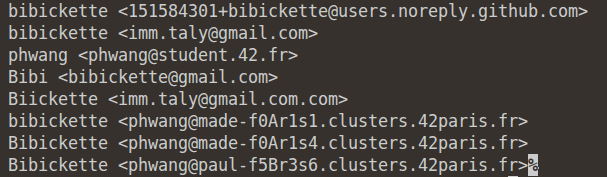
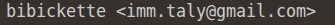

🇫🇷 Version française disponible [ici](README_FR.md)
* * *
# Project presentation - `update_my_newbie_commit_author`
## ⚠️ Disclaimer - Ethical use only

This script is intended **only to fix your own commits** that were made with an incorrect name or email due to a misconfigured Git setup.

❌ **Do NOT use this script to impersonate other contributors or steal commits that are not yours.**
Rewriting Git history to claim someone else’s work is unethical and unacceptable.

✅ You should only replace identities that **belong to you** and that you can legitimately prove are yours (old emails, usernames, machines, etc.).

* * *
## Description

This script helps you **update the author and committer of past Git commits**.

When you first started using Git, you might have made commits with the wrong name or email due to misconfigured `.gitconfig` because you're an actual newbie. This script allows you to fix those old commits without losing your commit history, keeping your repository clean while preserving all changes.

It uses `git filter-repo` to safely replace old emails and names with the correct ones.

Before running this script, it is strongly recommended to **check the commit authors and emails** in your repository : `git log --format="%an <%ae>" | sort | uniq`
This command lists all unique author names and emails present in the commit history, allowing you to clearly identify which identities should (or should not) be replaced.

**From this :**  
 

**To this :**  
 

### Arguments
The script takes 3 arguments:
1. `Python config file` : contains the lists of `BAD_EMAILS` and `BAD_NAMES` to replace, and `RIGHT_NAME` / `RIGHT_EMAIL` to replace them with. `my_newbie_commit_author.py` is an already existing file provided that you can just complete with your data
2. `Git repository URL` : the remote repository you want to push the changes to (SSH or HTTPS).
3. `Path to the local repository` : the path to the repository you want to update.

*⚠️ Important: Ensure the repository path and URL point to the same repository, otherwise adding the remote will fail.*

### Warning
- This script **rewrites Git history**. Anyone who has cloned the repository will need to re-clone it after running this script.
- **Always backup your repository** before running the script.
- Ensure you have **write access** to the Git repository.
- You need to have `git filter-repo` installed
- Consider using a **dry-run** or testing on a clone first to avoid accidental data loss.

* * *
## Languages & Technologies

**Language**
- Python
- Bash

**Technologies**
- git

* * *
# Using `update_my_newbie_commit_author`

## How to use `update_my_newbie_commit_author`

1. Clone `update_my_newbie_commit_author` in a folder first  : `git clone git@github.com:bibickette/update_my_newbie_commit_author.git`
2. Move into the repository : `cd update_my_newbie_commit_author`
3. Prepare your Python config file (`my_newbie_commit_author.py`), open the file for more details.
4. You can now run `./update_my_newbie_commit_author.sh my_newbie_commit_author.py git@github.com:username/repo.git /path/to/local/repo` to change your newbie commit from your git begin

### Improvements / Future Work
This project is a work in progress. Future improvements may include:
- Automatic repository backup before rewriting history
- Dry-run mode to preview changes
- Better validation of the Python config file
- Secure handling of remotes to prevent accidental pushes
